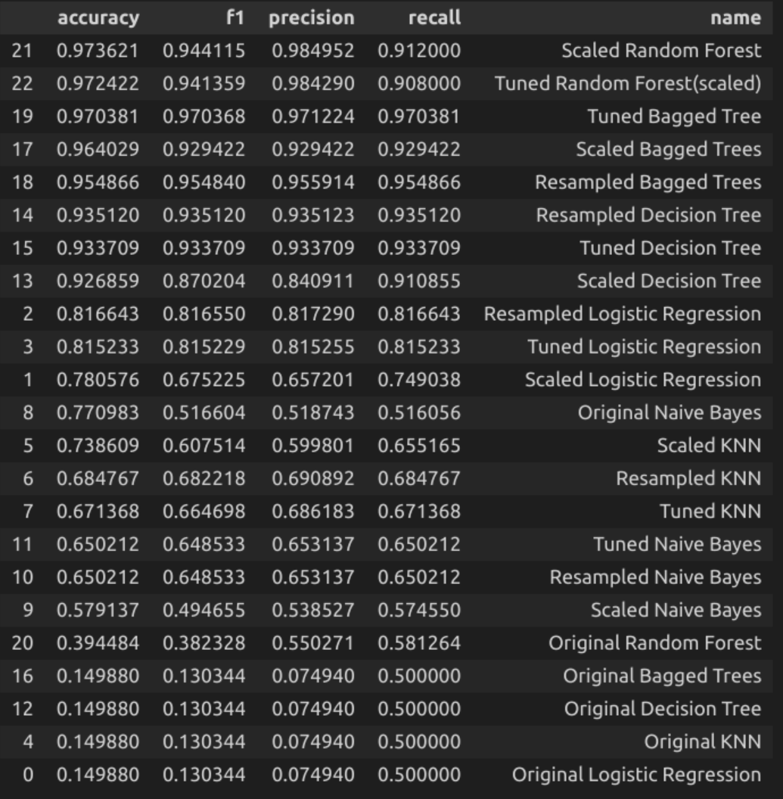
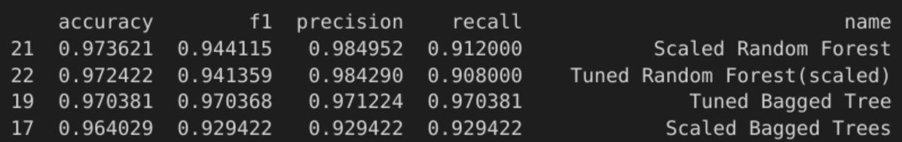
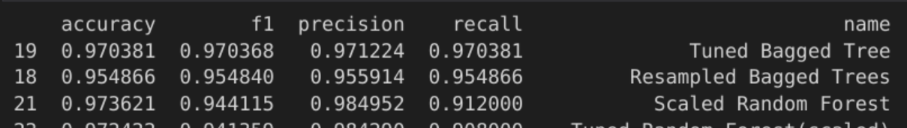
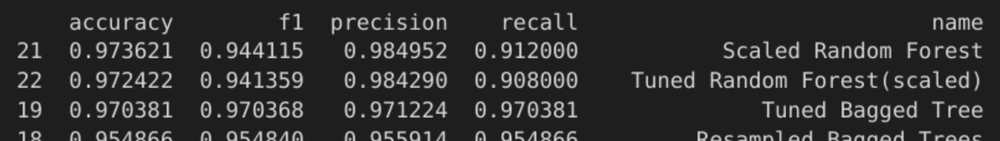
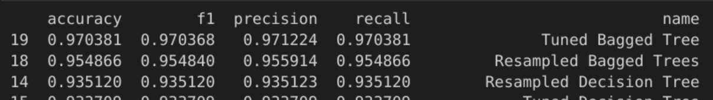

# **SyriaTel Customer Churn Analysis**

## Author: ***Henry Mativo Wamunyu***

## Company Overview 

Established in January 2000, SyriaTel has emerged as the premier telecommunications company in the region. With its headquarters situated in Damascus, Syria, the company has garnered a strong reputation for providing reliable and innovative communication services. SyriaTel has continuously demonstrated its commitment to delivering cutting-edge technology and seamless connectivity to its vast customer base.

## Business Understanding

In the business sector, accurately predicting and analyzing customer behavior patterns is a significant challenge. Various factors, including psychological, personal, social, and cultural aspects, influence consumer behavior such as motivation, perception, learning, beliefs, attitudes, age, occupation, lifestyle, and cultural background. Understanding these factors is crucial for businesses to effectively cater to customer needs and preferences.

As a data scientist, I have been hired to develop a robust model that can effectively predict which customers are likely to discontinue their services with SyriaTel.

### Data Understanding

SyriaTel has provided me with that includes information about their customers. The dataset contains information of 33,333 of SyriaTel customers and the features are as follows:

* `state` - Client's residence.
* `account length` - How long they have had the subscription.
* `area code` - Client's area code.
* `phone number` - Client's phone number.
* `international plan` - Is the client subscribed to the international plan?(yes/no).
* `voice mail plan` - Is the client subscribed to the voice mail plan?(yes/no).
* `number vmail messages` - The number of the voicemail messages.
* `total day minutes, calls, charge` - the client's daily minutes, calls, and charges.
* `total eve minutes, calls, charge` - the client's evening minutes, calls, and charges.
* `total night minutes, calls, charge` -the client's night minutes, calls, and charges.
* `total intl minutes, calls, charge` - the client's tital international minutes, calls, and charges.
* `customer service calls` - how many times the customer service line was called.
* `churn` - The response variable we will be targeting.

## Modelling 
Various models are created using logistic regression, decision tree and random forest algorithms. Hyperparameter tuning is applied to ldecision tree and random forest algorithms. 
A pipeline is used to prevent data leakage. Data is scaled in the pipeline. 
The image below shows a summary of the models and their performance.
 

             
### Evaluation
 
#### 1. **Accuracy:** 

Accuracy represents the proportion of correctly classified instances out of the total number of instances. Higher accuracy values indicate better performance.
 
In this case, the scaled random forest, the tuned random forest and the tunned bagged tree achieve the highest accuracy scores of above 0.97, indicating that they have the highest overall classification accuracy among the models.

#### 2. **F1-Score:** 

The F1-score is the harmonic mean of precision and recall. It provides a balanced measure between precision (ability to correctly identify positive instances) and recall (ability to correctly identify all positive instances). Similar to accuracy, higher F1-scores indicate better performance. 

In this case, the tuned bagged tree, the resampled bagged tree and the scaled random forest achieve the highest f1 scores of above 0.94, indicating that they have the highest overall classification f1 among the models.

#### 3. **Precision:** 

Precision represents the proportion of true positive predictions out of all positive predictions. It measures the model's ability to avoid false positives. Higher precision values indicate fewer false positives. 

In this case, the scaled random forest, the tuned random forest and tuned bagged tree have the highest precision scores, above 0.97.

#### 4. **Recall:**

Recall (also known as sensitivity or true positive rate) represents the proportion of true positive predictions out of all actual positive instances. It measures the model's ability to identify positive instances correctly. Higher recall values indicate fewer false negatives.

Tuned bagged tree, resampled bagged tree and resampled decision tree achieve the highest recall scores, above 0.93.

## Recommendations

1. The company should closely analyze the performance of states with low performance and determine if the issue lies in network coverage. If network coverage is found to be inadequate, we will develop a strategy to improve coverage by deploying additional boosters in those states.

2. SyriaTel's focus should be on investigating whether a more attractive international calling plan can encourage customers to consider its international plan while they are traveling.

3. SyriaTel should evaluate it's customer service and what it might be able to do better to assist the customer.
    - Additional training for customer service staff might be needed, but it also could be related to other factors.

4. SyriaTel should explore the possibility of engaging with different vendors or establishing temporary partnerships to provide incentives and promotions aimed at increasing customer satisfaction and reducing churn among dissatisfied customers.

## Next Step

**1. Network Coverage Improvement:**

    * Conduct a detailed analysis of poorly performing states to identify specific areas with network coverage issues.
    * Evaluate the feasibility and cost-effectiveness of deploying additional boosters or infrastructure to enhance network coverage in those areas.
    * Collaborate with the network operations team to plan and implement the expansion of network coverage.
    * Monitor the performance and impact of the network coverage improvements.

**2. International Calling Plan Enhancement:**

    * Conduct market research and competitor analysis to understand customers' preferences and demands regarding international calling plans.
    * Design and develop a more attractive international calling plan, considering factors such as competitive pricing, flexible options, and value-added features.
    * Communicate the new plan effectively to customers through targeted marketing campaigns and personalized offers.
    * Monitor customer response and adoption rates of the enhanced international calling plan.
**3. Vendor Partnership and Customer Incentives:**

    * Research potential vendors and partnership opportunities that can provide additional value or incentives for dissatisfied customers.
    * Establish collaboration or partnership agreements with selected vendors to offer exclusive promotions, discounts, or rewards to targeted customer segments.
    * Develop customer retention programs that leverage these partnerships and incentives to improve customer satisfaction and loyalty.
    * Monitor customer feedback, satisfaction levels, and churn rates to evaluate the effectiveness of the vendor partnerships and customer incentives.
**4. Implementation and Evaluation:**

    * Implement the proposed initiatives, including network coverage improvements, enhanced international calling plans, and vendor partnerships.
    * Monitor customer churn rates, customer satisfaction levels, and key performance indicators (KPIs) to assess the impact of the implemented strategies.
    * Calculate the cost associated with customer retention efforts and evaluate the return on investment (ROI).
    * Continuously analyze and optimize the implemented strategies based on the obtained results and customer feedback.

